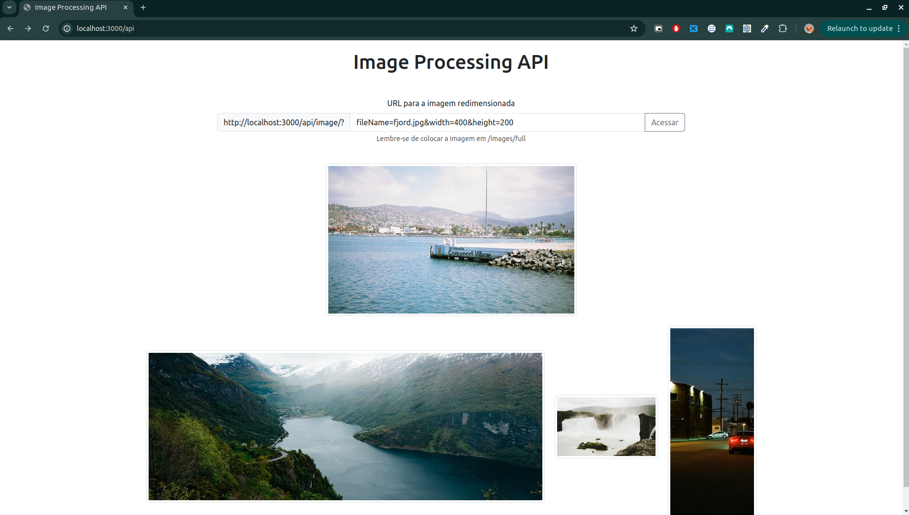
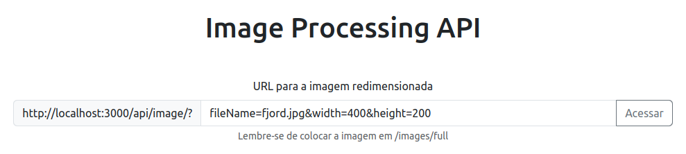

# Image Processing API



## Descrição

Este projeto tem como objetivo fornecer uma API de processamento de imagens que pode ser utilizada de duas formas distintas. Como uma API de placeholder simples, permite inserir imagens no frontend com o tamanho definido via parâmetros de URL, facilitando a prototipagem rápida. O segundo caso de uso é como uma biblioteca para servir versões redimensionadas corretamente das suas imagens para o frontend, reduzindo o tamanho do carregamento da página. A API trata do redimensionamento e da entrega das imagens armazenadas.

## Tecnologias

- Node.js
- Express
- TypeScript
- Sharp
- ESLint
- Prettier
- Bootstrap

## Instalação

1. Clone o repositório:

```
git clone https://github.com/seu-usuario/image-processing-api.git
```

2. Navegue até o diretório do projeto:

```
cd image-processing-api
```

3. Instale as dependências:

```
npm install
```
4. Execute com o node

```
node build/index
```

## Uso

> **Aviso:**
> Este programa foi desenvolvido e testado especificamente para sistemas operacionais baseados em Linux. Não há garantina de funcionamento em outros sistemas operacionais.

Para abrir a home do projeto acesse:

http://localhost:3000/api



Por padrão, o input já possui um valor válido mas é totalmente customizável.

| Parâmetro | Descrição      |
| --------- | -------------- |
| fileName  | Nome da imagem |
| width     | Largura        |
| height    | Altura         |

## Endpoints

- `\api`
- `\?fileName=<nome da imagem>.jpg&width=<largura>&height=<altura>`
